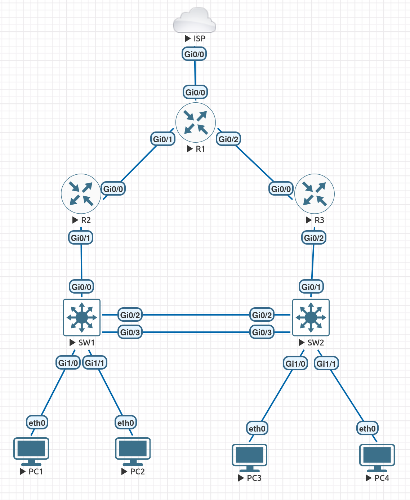

# Cisco Enterprise Network Lab

Enterprise network lab built in EVE-NG using Cisco IOL routers and switches.

This personal EVE-NG lab models a small enterprise network with Layer 2 and first-hop redundancy, OSPF routing, IPv4/IPv6, NAT/PAT, and basic network security.

The repository includes a topology diagram, an addressing plan, design notes, and captured Cisco IOS verification outputs. Device configurations, before/after failover captures, and troubleshooting records are not yet complete; see [Known gaps](#known-gaps-and-next-steps).


## Network Topology



The ISP and external Internet destination are simulated.


## VLAN Design

| VLAN | Name | Purpose | IPv4 Subnet | IPv6 Prefix |
|---|---|---|---|---|
| 10 | USERS | User workstations | 192.168.10.0/24 | 2001:db8:10::/64 |
| 20 | ADMIN | Administrative devices | 192.168.20.0/24 | 2001:db8:20::/64 |
| 30 | SERVERS | Server segment | 192.168.30.0/24 | 2001:db8:30::/64 |
| 99 | MANAGEMENT | Network management | 192.168.99.0/24 | 2001:db8:99::/64 |

## IP Addressing Plan

### Routed Links

| Link | Device | Interface | IPv4 Address | IPv6 Address |
|---|---|---|---|---|
| ISP-R1 | ISP | Gi0/0 | 203.0.113.1/30 | - |
| ISP-R1 | R1 | Gi0/0 | 203.0.113.2/30 | - |
| R1-R2 | R1 | Gi0/1 | 10.0.12.1/30 | 2001:db8:12::1/64 |
| R1-R2 | R2 | Gi0/0 | 10.0.12.2/30 | 2001:db8:12::2/64 |
| R1-R3 | R1 | Gi0/2 | 10.0.13.1/30 | 2001:db8:13::1/64 |
| R1-R3 | R3 | Gi0/0 | 10.0.13.2/30 | 2001:db8:13::2/64 |

### HSRP Gateways

| VLAN | Virtual Gateway | R2 Address | R3 Address | Preferred Active Router |
|---|---|---|---|---|
| 10 | 192.168.10.1 | 192.168.10.2 | 192.168.10.3 | R2 |
| 20 | 192.168.20.1 | 192.168.20.2 | 192.168.20.3 | R2 |
| 30 | 192.168.30.1 | 192.168.30.2 | 192.168.30.3 | R3 |
| 99 | 192.168.99.1 | 192.168.99.2 | 192.168.99.3 | R3 |

## Endpoint Assignment

| Host | VLAN | IPv4 Addressing | Default Gateway |
|---|---|---|---|
| PC1 | 10 | DHCP | 192.168.10.1 |
| PC2 | 20 | DHCP | 192.168.20.1 |
| PC3 | 10 | DHCP | 192.168.10.1 |
| PC4 | 30 | DHCP | 192.168.30.1 |


## Network Design

### Layer 2 Design

SW1 and SW2 are connected using an LACP EtherChannel consisting of two physical links.

The Port-Channel operates as an 802.1Q trunk and carries VLANs 10, 20, 30, and 99.

Rapid-PVST+ is used for Layer 2 loop prevention and convergence.

To optimize traffic paths:

- SW1 is the STP root bridge for VLANs 10 and 20
- SW2 is the STP root bridge for VLANs 30 and 99

This design aligns the Layer 2 forwarding path with the preferred HSRP gateway for each VLAN.

### First-Hop Redundancy

HSRP provides redundant default gateways for all user VLANs.

- R2 is the preferred Active router for VLANs 10 and 20
- R3 is the preferred Active router for VLANs 30 and 99

Each VLAN uses `.1` as the HSRP virtual IPv4 gateway.

HSRP preemption is enabled so that the preferred router resumes the Active role after recovery.

### Layer 3 Routing

R1, R2, and R3 participate in OSPF Area 0.

The routed point-to-point links are:

- R1-R2: 10.0.12.0/30
- R1-R3: 10.0.13.0/30

R2 and R3 advertise the internal VLAN networks into OSPF.

User-facing VLAN interfaces are configured as passive OSPF interfaces. This allows the networks to be advertised without forming unnecessary OSPF adjacencies on access VLANs.

R1 learns the internal networks through both R2 and R3 and can install equal-cost routes when both paths are available.

### Internet Edge

R1 acts as the enterprise edge router.

It provides:

- Static default routing toward the simulated ISP
- NAT/PAT for internal IPv4 networks
- OSPF default-route advertisement toward R2 and R3

The ISP router uses a loopback interface with address `8.8.8.8/32` to simulate an external destination.

**NAT audit needed:** The saved [R1 NAT statistics](verification/nat.txt) show `GigabitEthernet0/2` as an **outside** interface, even though [the diagram](topology/topology.png) identifies it as R1's internal link to R3. This could be a configuration error or stale verification output. Without the running configuration, the actual cause cannot be confirmed. See [NAT interface audit](troubleshooting/nat-interface-audit.md).

### IPv6 Design

The network operates in dual-stack mode.

IPv6 routing uses OSPFv3 over the same routed topology.

IPv6 prefixes are assigned per VLAN using the documentation prefix `2001:db8::/32`.

As with OSPFv2, user-facing interfaces are configured as passive OSPFv3 interfaces to prevent unnecessary neighbor formation.


## Security Design

### Extended ACLs

An extended access control list is used to restrict access from the USERS VLAN to the MANAGEMENT VLAN.

Traffic from VLAN 10 (`192.168.10.0/24`) to VLAN 99 (`192.168.99.0/24`) is denied, while other traffic from the USERS VLAN is permitted.

The ACL is applied inbound on the VLAN 10 subinterfaces of both R2 and R3 so that the security policy remains effective even after an HSRP failover.

### Port Security

Port Security is enabled on user-facing switch ports.

The configuration limits each access port to a single MAC address and uses sticky MAC learning.

Violation mode is set to `restrict`, allowing the port to remain operational while unauthorized frames are dropped and violation counters are incremented.

### DHCP Snooping

DHCP Snooping is enabled for VLANs 10, 20, and 30.

Only trusted uplinks toward the DHCP-serving routers and the inter-switch Port-Channel are configured as trusted interfaces.

User-facing access ports remain untrusted.

DHCP request rate limiting is configured on access ports to reduce the impact of DHCP starvation attacks.

### Security Verification

The following commands can be used to verify the security configuration:

```text
show access-lists
show port-security
show port-security address
show ip dhcp snooping
show ip dhcp snooping binding
```

The saved [security evidence](verification/security.txt) includes ACL match counters, port-security state, and DHCP snooping status. A DHCP snooping binding-table capture is not currently included.

## Verification and Evidence

Saved device CLI output is available for the following functions:

| Function | File | Evidence |
|---|---|---|
| LACP and trunks | [etherchannel.txt](verification/etherchannel.txt) | Both switches report `Po1(SU)` with bundled LACP members and expected allowed VLANs |
| Rapid-PVST+ | [spanning-tree.txt](verification/spanning-tree.txt) | SW1 root for VLANs 10/20 and SW2 root for VLANs 30/99 |
| HSRP | [hsrp.txt](verification/hsrp.txt) | Normal Active/Standby roles; failover evidence has not been saved |
| OSPFv2 | [ospf.txt](verification/ospf.txt) | R1 has FULL adjacencies with R2 and R3, and equal-cost routes to VLANs |
| OSPFv3 and IPv6 | [ipv6.txt](verification/ipv6.txt) | IPv6 adjacencies and learned routes; end-host IPv6 tests are not saved |
| DHCP | [dhcp.txt](verification/dhcp.txt) | Lease bindings on R2 and R3 |
| NAT/PAT | [nat.txt](verification/nat.txt) | ICMP translations; **interface-role discrepancy remains unresolved** |
| ACL, port security and DHCP snooping | [security.txt](verification/security.txt) | ACL matches, sticky secure MAC and DHCP snooping interface state |

### HSRP Failover — Follow-up Verification Needed

The intended failover behavior is for R3 to become Active for VLANs 10/20 if R2's LAN-facing interface fails, and for R2 to resume its preferred role after recovery. The existing [HSRP output](verification/hsrp.txt) captures the normal state only; it does **not** prove that a failover test succeeded.

To verify this in EVE-NG:

1. Save `show standby brief` from R2 and R3, and start pings from a VLAN 10 host to its gateway and a reachable remote destination.
2. In the lab only, shut down R2 `Gi0/1` and save R3's HSRP status and the host ping results.
3. Restore R2's interface and document whether preemption and host connectivity recover as expected.
4. Add before/during/after outputs to `verification/` and describe the actual result.

## Technologies

- VLANs
- 802.1Q Trunking
- LACP EtherChannel
- Rapid-PVST+
- Router-on-a-Stick
- HSRP
- OSPFv2
- OSPFv3
- IPv4 / IPv6 Dual Stack
- DHCP
- NAT/PAT
- Extended ACLs
- Port Security
- DHCP Snooping
- ECMP
- Passive OSPF Interfaces

## Platform

- EVE-NG
- Cisco IOL
- Cisco IOL L2
- VPCS

## Known Gaps and Next Steps

- **Device configurations:** The `configs/` folder does not yet contain the running configurations of R1, R2, R3, ISP, SW1, or SW2. See [export guidance](configs/README.md).
- **NAT:** Audit R1 interface roles using actual configuration and retest through both internal paths. See [NAT interface audit](troubleshooting/nat-interface-audit.md).
- **HSRP:** Save before/during/after failover evidence and host connectivity tests.
- **IPv6:** Save end-to-end host connectivity evidence (only OSPFv3 adjacencies/routes are currently recorded).
- **Troubleshooting:** Document at least one real fault, diagnosis, corrective action and retest; do not invent incidents.

## Project Status

**Personal EVE-NG lab — documentation and verification in progress.** Existing CLI output supports several implemented features; the unresolved items above are not presented as fixed.


